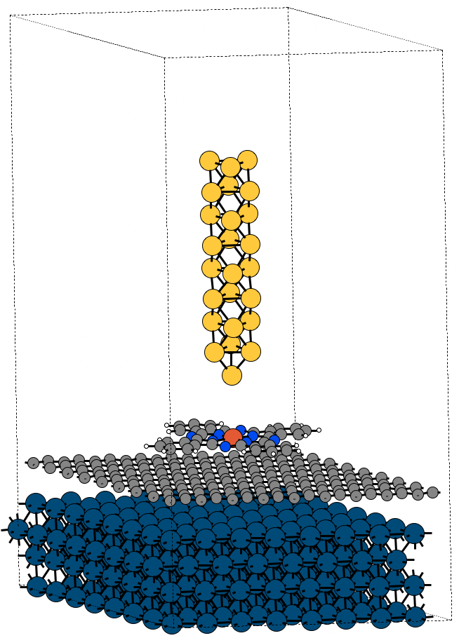

# Device Module
---------------

The `device` module provides a simple and efficient way to create a molecular junction model for projects involving molecular electronics. This module utilizes the Atomic Simulation Environment (ASE) library to build and manipulate molecular structures.


## Installation
---------------
To use the `device` module, you need to install the ASE library:

```python
pip install ase
```

## Example Usage
---------------

The following example demonstrates how to use the device module to set up a molecular junction model, as investigated in the paper "Strong Electron-Vibration Signals in Weakly Coupled Molecular Junctions: Activation of Spin-Crossover" (Nano Letters, 2024, ASAP, doi: https://doi.org/10.1021/acs.nanolett.4c01684):

```python
# Import necessary libraries
import math as m
import numpy as np
from ase import io
from ase.build import fcc111
from device import setup_device, setup_gr

# Define constants
a_graphene = 2.467  # found by LDA relaxation
d_Ir_gr = 3.23        # opt by LDA
d_gr_fepc = 3.20      # opt by LDA
d_fepc_tip = 5.0      # guess
a_Ir = a_graphene*9./8.*m.sqrt(2)

# Build the substrate: Gr9x9/Ir8x8
Ir111 = fcc111('Ir', size=(8, 8, 6), a=a_Ir, vacuum=17.5, periodic=True)
del Ir111[-8*8*2:]
dev = setup_device(atoms=Ir111)
dev.shift_to_bottom()
gr = setup_gr(a=a_graphene, gamma=60, size=(9, 9, 1))
gr.translate([-gr.cell[1]])
dev.add_atoms(in_atoms=gr, offset=d_Ir_gr, atoms_pbc=True)

# Add the molecule and tip to the device
tip = io.read('tip.xyz')
spin = 'is'
device = dev.copy()
molecule = io.read('fe-%s-LDA-U4.0.STRUCT_OUT' % spin)
device.add_atoms(in_atoms=molecule, offset=d_gr_fepc, atoms_pbc=False)
tip.set_cell(device.atoms.cell)
tip.center()
aupos = tip.get_positions()
tip_atom_index = np.argmin(aupos[:, 2])
pos_Au = aupos[tip_atom_index]
for atom in device.atoms:
    if atom.symbol == 'Fe':
        pos_Fe = atom.position
vector = pos_Fe-pos_Au
shift = [vector[0], vector[1], 0]
tip.translate(shift)        # shift the tip to point at Fe
device.add_atoms(in_atoms=tip, offset=d_fepc_tip, atoms_pbc=True)

# Write the device to a file
io.write('device-%s.vasp' % spin, device.atoms)
```

This example showcases the use of the `device` module to create a molecular junction model that includes a Fe(II) phthalocyanine molecule placed on a graphene-coated Ir(111) surface and a gold tip.

{: width="400"}

## Functions
---------------
The device module provides the following functions:

- `setup_device(atoms)`: Sets up a device model from a given ASE atoms object.
	- `add_atoms(in_atoms, offset, atoms_pbc)`: Adds atoms to the device model with the given offset and periodic boundary conditions.
	- `attach_electrodes(left_electr, right_electr)`: Attach electrodes to a molecular junction model.
- `setup_gr(a, gamma, size)`: Sets up a graphene substrate with the given lattice constant, gamma angle, and size.


Note: This is a basic example of how to use the `device` module. You can extend the module to include more features and functionality as needed.


